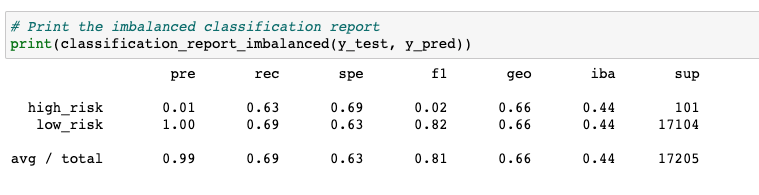

# Credit_Risk_Analysis

## Overview of the loan prediction risk analysis:

Module 17 gives us the chance to combine our skills in data preparation, statistical reasoning and machine learning.  Our goal is to understand and build a model that will assist in predicting credit risk.  

Credit risk can be seen as an unbalanced classification problem.  In general, there are more good loans compared to risky loans.   We were asked to use imbalanced-learn and scikit-learn libraries to build and evaluate models using resampling.  

Our credit card credit dataset comes from LendingClub, a peer-to-peer lending services company.  We will first oversample the data using the RandomOverSampler and SMOTE algorithms and under sample the data using the ClusterCentroids algorithm. After the combinatorial approach of over- and undersampling, we will compare two new machine learning models to reduce bias, BalancedRandomForestClassifier and EasyEnsembleClassifier, to predict credit risk.

## Results:

There is a bulleted list that describes the balanced accuracy score and the precision and recall scores of all six machine learning models (15 pt)

## Summary:

There is a summary of the results (2 pt)
There is a recommendation on which model to use, or there is no recommendation with a justification (3 pt)
